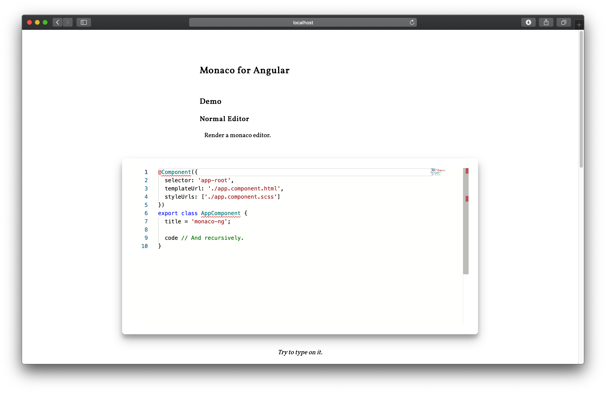

# @silicic/monaco-ng

A [monaco editor](https://microsoft.github.io/monaco-editor/) loader and renderer for Angular.



[Demo](https://si-monaco-ng.wendzhue.now.sh)

## Features

1. Load resources of monaco editor from static file server or CDN.
2. Render a monaco editor in a declarative way.
3. Support both IEditor and IDiffEditor.
4. Provide hooks like onInit for you config themes, langauges etc..
5. Support default editor options.
6. Fully controlled mode.
7. Update editor option of all editor instances from a service.
8. Auto respond to resize events.

## Installation

Install with npm:

```bash
npm install @silicic/monaco-ng
```

## Usage

### Install monaco-editor

You should install monaco-editor in your project.

```bash
npm install monaco-editor --save-dev
```

monaco-ng loads resources of monaco-editor asynchronously, so you should store store them somewhere. For example, you can put them with other static files. Add these lines in angular.json

```diff
{
  "assets": [
    "src/favicon.ico",
    "src/assets",
+   {
+     "glob": "**/*",
+     "input": "./node_modules/monaco-editor/min/vs",
+     "output": "/assets/vs/"
+   }
  ],
}
```

> All you could provide `assetsRoot` to load monaco editor from CDN. See below.

### Provide configurations

You can choose to provide configurations with the injection `MONACO_CONFIG` in the root.

For example,

```ts
@NgModule({
  declarations: [AppComponent],
  imports: [],
  providers: [
    {
      provide: MONACO_CONFIG,
      useValue: {
        defaultEditorOption: {
          language: 'typescript',
          fontSize: 14
        },
        onLoad() {
          // Register langauges, themes etc.
        }
      }
    }
  ],
  bootstrap: [AppComponent]
})
export class AppModule {}
```

Not only could you provide default editor options, but also use hooks to do extra works.

### Render an editor

It's every easy to render an editor. You just have to declare one in the template:

```html
<si-monaco-editor
  [ngModel]="code"
  [editorOption]="editorOption"
></si-monaco-editor>
```

### Fully controlled mode

You can also get the monaco editor instance from the output `editorInitialized`. If you don't want monaco-ng to deal with text models for you, you can set `fullControl` to `true`, get the monaco editor instance, and then play with it.

```ts
@Component({
  selector: 'your-editor-component',
  template: `
    <si-monaco-editor
      [fullControl]="true"
      (editorInitialized)="withEditor($event)"
    ></si-monaco-editor>
  `
})
export class YourEditorComponent {
  editor; // monaco editor instance

  withEditor(editor) {
    this.editor = editor;
  }
}
```

## API

### si-monaco-editor

| Property              | Description                              | Type                                                           | Default Value |
| --------------------- | ---------------------------------------- | -------------------------------------------------------------- | ------------- |
| `[mode]`              | Create a normal editor or a diff editor. | `normal \| diff`                                               | `normal`      |
| `[originalText]`      | Only valid when `mode` is set to `diff`. | `normal \| diff`                                               | `normal`      |
| `[fullControl]`       | Enable full-control mode.                | `boolean`                                                      | `false`       |
| `[editorOption]`      | Editor options.                          | `IEditorConstructionOptions \| IDiffEditorConstructionOptions` | `{}`          |
| `(editorInitialized)` | Emit an editor when it's ready           | `Subject<IEditor \| IDiffEditor>`                              | `false`       |

### MonacoService

### MONACO_CONFIG

Configurations of `MonacoService`. It should be provided in the root.

Its type should be `MonacoConfig`.

| Property            | Description                                                         | Type     | Default Value |
| ------------------- | ------------------------------------------------------------------- | -------- | ------------- |
| assetsRoot          | It tells monaco-ng where to load resources of monaco editor.        | string   | -             |
| defaultEditorOption | Default options of monaco editor.                                   | Object   | {}            |
| onLoad              | A hook that get invoked when resources of monaco editor get loaded. | Function | -             |
| onFirstEditorInit   | A hook that get invoked when the first monaco editor is created.    | Function | -             |
| onInit              | A hook that get invoked when a monaco editor is created.            | Function | -             |

## License

MIT
